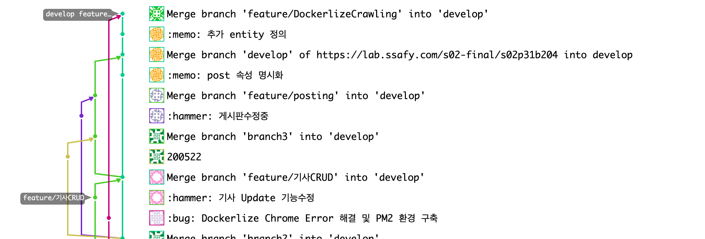

# Crawling API

### 뉴스 라이브 : 블록체인 기반 뉴스 플랫폼

현대인들은 뉴스를 인터넷 매체를 통해 대기업, 보도 매체에 의한 선별된 기사, 의도를 가지고 작성한 기사, 똑같은 기사를 무분별하게 받아들이고 있습니다. 또한 기자들은 이익 또는 억압에 의해 저널리즘을 발휘하지 못하고 이익을 위한 의도적인 기사를 작성하며 교묘하게 처벌을 피해가고 있습니다.
이에 따라 기자의 뉴스 배포 이후의 배포, 수정, 삭제, 신고 내역을 블록체인에 저장 및 공개합니다.
블록체인으로 탈중앙화되어 운영되는 프랫폼을 통해 기자는 대기업, 자본, 매체에 의한 억압에서 벗어 날 수 있으며, 오로지 구독자의 신고 즉, 민주적인 절차에 의해서만 재약을 받습니다.
또한 모든 뉴스의 정보가 저장됨에 따라 기자는 자신의 작성한 기사로 부터 온전한 책임을 갖게 되어 법적 분쟁 및 사회적 책임에 대한 증거 자료로서 활용될 수 있습니다.

### 위 프로젝트를 위한 Crawling API 부분입니다.

현재 짅행중인 프로젝트를 위해 형태소 분석 부분을 크롤링 API 구현 및 무중단을 위해 pm2 실행 구현

추후 분산화를 위한 Docker 배포를 위한 Dockefile 구현

## 구현 스택

Node.js

express : Rest-API  #현재는 post만 사용중입니다.

puppeteer cheerio : 크롤링 라이브러리

## 어려웠던 부분

### 1. Docker를 통한 배포

- Error: Failed to launch the browser process
  위에러는 Docker환경에서 chrom에 접근하지 못하여 생기는 문제였습니다. 따라서 Docker파일에서 추가적인 모듈다운로드 및 설정이 필요로 했습니다.
  - 

### 2. 크롤링한 page중 일부를 가져올때 HTML의 문법에서 벗어나면 읽지 못하는 현상

처음에 table 테그의 tbody부분만 필요로하여 tbody부분 만 접근여 파싱하려 했을때 재대로 이루어지지 않았습니다.

하지만 table테그 전체를 가져와서 해결했습니다.

## 구현 확인

### 도커 컨테이너 

### PostMan을 통한 API 확인

## 현재 Git 및 Jira 관리

